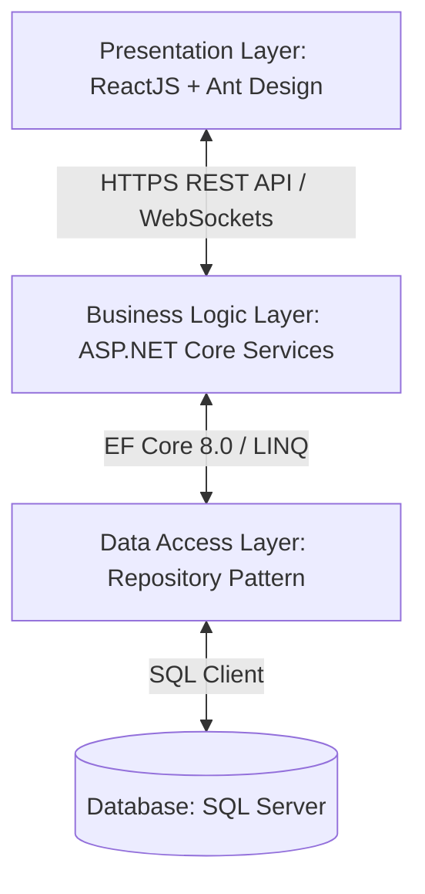

# BÁO CÁO THỰC TẬP TỐT NGHIỆP

**ĐỀ TÀI:**
**XÂY DỰNG PHÂN HỆ QUẢN LÝ TRONG HỆ THỐNG THI TRẮC NGHIỆM ĐÁNH GIÁ NĂNG LỰC ĐIỀU DƯỠNG "BÀN TAY VÀNG"**

* **Sinh viên thực hiện:** [Họ và tên Sinh viên]
* **Mã số sinh viên:** [Mã sinh viên]
* **Lớp:** [Tên Lớp]
* **Ngành:** Công nghệ thông tin
* **Đơn vị thực tập:** Bệnh viện Đa khoa Thống Nhất - Phòng Công nghệ thông tin & Phòng Điều dưỡng
* **Giảng viên hướng dẫn:** [Họ và tên Giảng viên]

---

## MỤC LỤC
* [Chương 1: Tổng quan](#chương-1-tổng-quan)
* [Chương 2: Cơ sở lý thuyết](#chương-2-cơ-sở-lý-thuyết)
* [Chương 3: Cài đặt thử nghiệm](#chương-3-cài-đặt-thử-nghiệm)
* [Chương 4: Kết luận](#chương-4-kết-luận)
* [Phụ lục](#phụ-lục)
* [Tài liệu tham khảo](#tài-liệu-tham-khảo)

---

## CHƯƠNG 1: TỔNG QUAN

### 1. Giới thiệu về cơ quan thực tập
#### 1.1 Sơ lược về nơi thực tập
Bệnh viện Đa khoa Thống Nhất là bệnh viện hạng I tuyến tỉnh, quy mô hơn 1.000 giường bệnh, đảm nhận vai trò khám chữa bệnh, cấp cứu và chăm sóc sức khỏe cho nhân dân trong khu vực. Với mục tiêu xây dựng "Bệnh viện thông minh", bệnh viện đã và đang đẩy mạnh ứng dụng Công nghệ thông tin (CNTT) vào mọi hoạt động quản lý, vận hành và nâng cao chất lượng chuyên môn.

Quá trình thực tập của nhóm sinh viên được thực hiện tại hai phòng ban phối hợp:
* **Phòng Công nghệ thông tin:** Đảm nhiệm vai trò xây dựng hạ tầng phần cứng, phát triển phần mềm ứng dụng nội bộ, tích hợp các hệ thống quản lý thông tin bệnh viện (HIS, LIS, PACS) và hỗ trợ kỹ thuật cho toàn bộ nhân viên y tế.
* **Phòng Điều dưỡng:** Đơn vị chịu trách nhiệm quản lý, giám sát và đào tạo chuyên môn cho đội ngũ hơn 600 điều dưỡng viên, hộ sinh và kỹ thuật viên y tế. Phòng Điều dưỡng là đơn vị trực tiếp đề xuất và sử dụng nghiệp vụ của đề tài này.

#### 1.2 Cơ cấu tổ chức của cơ quan nơi thực tập
* **Ban Giám đốc Bệnh viện:** Chỉ đạo toàn diện các hoạt động của bệnh viện, phê duyệt chủ trương số hóa và cải tiến quy trình.
* **Phòng Công nghệ thông tin:** Gồm Trưởng phòng, các Kỹ sư phần mềm, Kỹ sư hệ thống mạng và Kỹ sư phần cứng. Môi trường làm việc năng động, chuyên nghiệp, áp dụng các quy trình phát triển phần mềm chuẩn mực.
* **Phòng Điều dưỡng:** Gồm Trưởng phòng Điều dưỡng, các Điều dưỡng phó và Điều dưỡng trưởng của các khoa lâm sàng/cận lâm sàng.
* **Các khoa phòng lâm sàng:** Nơi các điều dưỡng viên trực tiếp làm công tác chuyên môn chăm sóc bệnh nhân.

#### 1.3 Hoạt động chuyên ngành và môi trường làm việc của cơ quan nơi thực tập
Phòng Điều dưỡng thường xuyên tổ chức các lớp đào tạo liên tục và kỳ thi kiểm tra năng lực chuyên môn định kỳ hàng quý, hàng năm, nổi bật nhất là hội thi **"Bàn tay vàng"** dành cho điều dưỡng. Đây là cơ sở quan trọng để đánh giá, phân loại và nâng bậc chức danh cho điều dưỡng viên.
Môi trường làm việc tại Bệnh viện đòi hỏi tính chính xác cực kỳ cao, sự minh bạch trong đánh giá năng lực và tính an toàn thông tin tuyệt đối. Đội ngũ IT tại bệnh viện hỗ trợ nhiệt tình, tạo điều kiện thuận lợi cho sinh viên thực tập tiếp cận cơ sở dữ liệu giả lập và quy trình nghiệp vụ thực tế.

---

### 2. Giới thiệu về nội dung công việc được giao thực tập
#### 2.1 Vấn đề cần giải quyết và tính cấp thiết
Đánh giá năng lực điều dưỡng viên là công tác thường niên cực kỳ quan trọng tại bệnh viện để đảm bảo chất lượng chăm sóc và an toàn người bệnh. Trước đây, việc tổ chức phần thi lý thuyết trắc nghiệm được thực hiện thủ công trên giấy, bộc lộ các hạn chế:
* **Tốn thời gian và nhân lực:** Phòng Điều dưỡng phải mất nhiều ngày để soạn câu hỏi, trộn đề bằng tay, in ấn đề thi cho hàng trăm thí sinh, phát đề, thu bài và tổ chức chấm thi thủ công.
* **Nguy cơ sai sót cao:** Việc chấm thi thủ công dễ dẫn đến nhầm lẫn điểm số của thí sinh. Việc tổng hợp, phân tích phổ điểm để đánh giá chất lượng cũng mất nhiều thời gian.
* **Khó chống gian lận:** Do phòng thi đông người, việc sử dụng các mã đề in sẵn trên giấy vẫn có thể bị thí sinh nhìn bài hoặc trao đổi đáp án.
* **Hạn chế về nghiệp vụ y khoa đặc thù:** Các phần mềm thi trắc nghiệm phổ thông hiện nay chưa đáp ứng tốt nhu cầu thi lâm sàng (câu hỏi case study phức tạp, đính kèm hình ảnh điện tâm đồ ECG, hình ảnh X-quang độ phân giải cao; chấm điểm tự luận kết hợp bảng kiểm checklist; phân quyền theo khoa phòng và cơ chế giám sát thời gian thực).

Từ đó, đề tài **"Hệ thống phần mềm thi trắc nghiệm Bàn tay vàng dành cho điều dưỡng"** được xây dựng bởi nhóm sinh viên thực tập nhằm số hóa toàn bộ quy trình thi cử.
Trong nhóm, nhiệm vụ cụ thể của tác giả báo cáo này là **phát triển phân hệ Quản lý (Manager & Administrator Functions)** bao gồm cả phần thiết kế Backend (API) và xây dựng Frontend (giao diện quản trị).

#### 2.2 Tình hình giải quyết vấn đề
* **Trên thế giới và tại Việt Nam:** Có nhiều hệ thống thi trực tuyến như Moodle, Kahoot, Azota... Tuy nhiên, các hệ thống này mang tính chất đại trà, thiếu các ràng buộc y khoa đặc thù như quản lý câu hỏi theo Khoa/Phòng bệnh viện, chia ca thi linh hoạt theo lịch trực của điều dưỡng, chấm điểm theo trọng số/điểm liệt của các quy trình kỹ thuật bắt buộc, và đặc biệt là hệ thống giám sát thời gian thực (real-time monitor) giúp phát hiện lập tức hành vi gian lận (chuyển tab, thoát fullscreen) qua SignalR.
* **Kết quả và tồn tại của các giải pháp trước:** Trước đó, bệnh viện từng thử nghiệm một số công cụ Google Forms nhưng không bảo mật, dễ bị lộ đề thi và không có tính năng chống gian lận hay xuất báo cáo tự động theo form mẫu của Bộ Y tế.
* **Tính mới của đề tài:** Đề tài xây dựng một hệ thống chuyên biệt, tích hợp trực tiếp cơ chế real-time push cảnh báo gian lận, import đề thi thông minh phân tách theo loại câu hỏi (trắc nghiệm, đúng/sai, điền khuyết, tự luận, case lâm sàng), phân quyền chặt chẽ đến từng khoa phòng (Dept Manager chỉ quản lý câu hỏi/thí sinh thuộc khoa của mình), đảm bảo an toàn dữ liệu và tuân thủ các quy tắc bảo mật OWASP Top 10.

---

### 3. Phạm vi của đề tài
Đề tài tập trung vào việc nghiên cứu, thiết kế và phát triển **phân hệ các chức năng dành cho người quản lý** trong hệ thống thi trắc nghiệm "Bàn tay vàng". Cụ thể, phạm vi giải quyết bao gồm:
* **Quản trị hệ thống (Admin):** Quản lý tài khoản người dùng, phân quyền chi tiết, quản lý danh mục khoa phòng, xem nhật ký hệ thống (Audit Logs) để truy vết thao tác.
* **Quản lý đào tạo (Teacher/Dept Manager):** Quản lý ngân hàng câu hỏi (CRUD, import/export Excel), tạo và cấu hình kỳ thi/ca thi, phân công thí sinh tham gia thi, chấm thi tự luận và chấm theo checklist lâm sàng.
* **Giám sát thi (Supervisor):** Giám sát thời gian thực tiến độ làm bài của thí sinh, nhận cảnh báo gian lận tức thời qua SignalR, can thiệp từ xa (gia hạn giờ làm bài hoặc đình chỉ thi).
* **Báo cáo thống kê:** Thống kê phổ điểm, tỷ lệ đạt/rớt theo khoa phòng, theo nhóm chức danh, vẽ biểu đồ trực quan và xuất file báo cáo Excel/PDF.

*Giới hạn đề tài:* Hệ thống tập trung đánh giá lý thuyết trắc nghiệm và tình huống lâm sàng giả lập, không bao gồm việc đánh giá thao tác thực hành lâm sàng trực tiếp trên mô hình hay bệnh nhân.

---

## CHƯƠNG 2: CƠ SỞ LÝ THUYẾT

### 1. Lý thuyết
#### 1.1 Cơ chế xác thực và phân quyền với JSON Web Token (JWT)
Hệ thống sử dụng cơ chế xác thực không trạng thái (stateless authentication) bằng JWT. Khi người dùng đăng nhập thành công, máy chủ cấp một cặp gồm `AccessToken` (có hiệu lực trong 60 phút) và `RefreshToken` (có hiệu lực trong 30 ngày) để duy trì phiên.
Mọi request từ client đến API quản lý đều phải đính kèm token trong Header:
`Authorization: Bearer {AccessToken}`

Hệ thống phân quyền dựa trên vai trò (Role-based Access Control - RBAC) kết hợp phân quyền theo Khoa/Phòng (Department-based Access Control). Các vai trò chính gồm:
1. **Admin (Id=1):** Toàn quyền cấu hình hệ thống, quản lý danh mục và tài khoản.
2. **Teacher (Id=2) / Dept Manager:** Quản lý câu hỏi, đề thi và thí sinh thuộc khoa của mình.
3. **Student (Id=3):** Chỉ có quyền làm bài thi được phân công.
4. **Supervisor (Id=4):** Giám sát phòng thi thời gian thực.

#### 1.2 Thuật toán xáo trộn Fisher-Yates (Fisher-Yates Shuffle)
Để đảm bảo tính công bằng và chống quay cóp giữa các thí sinh ngồi cạnh nhau, hệ thống tự động xáo trộn ngẫu nhiên thứ tự các câu hỏi trong đề thi và thứ tự các lựa chọn (A, B, C, D) cho từng thí sinh.
Thuật toán Fisher-Yates được cài đặt ở Backend với `Seed = IdBaiThi` (đối với câu hỏi) và `Seed = IdBaiThi * 1000 + IdCauHoi` (đối với đáp án). Điều này đảm bảo:
* Mỗi thí sinh có một trật tự hiển thị đề thi riêng biệt và duy nhất.
* Trật tự hiển thị này cố định trong suốt phiên làm bài của thí sinh đó (kể cả khi refresh trang hay mất mạng tải lại).
* Giải thuật có độ phức tạp thời gian tối ưu \(O(N)\).

#### 1.3 Cơ chế truyền thông thời gian thực với ASP.NET Core SignalR
SignalR được sử dụng để thiết lập kết nối song hướng (duplex connection) thời gian thực giữa Client và Server thông qua giao thức WebSockets.
Trong phân hệ giám sát (Exam Monitoring), SignalR giúp truyền tải tức thời các sự kiện:
* `StudentProgress`: Thí sinh hoàn thành thêm 1 câu hỏi -> cập nhật tiến độ trên màn hình giám thị.
* `CheatingWarning`: Thí sinh chuyển tab, thoát chế độ toàn màn hình -> gửi cảnh báo đỏ ngay lập tức lên dashboard của giám thị.
* `StudentHeartbeat`: Thiết bị của thí sinh gửi tín hiệu định kỳ mỗi 10 giây để chứng minh vẫn đang kết nối.

---

### 2. Kỹ thuật
Hệ thống được xây dựng theo mô hình Single Page Application (SPA) kết hợp Web API, sử dụng các công nghệ hiện đại sau:

| Thành phần | Công nghệ sử dụng | Vai trò trong hệ thống |
|---|---|---|
| **Cơ sở dữ liệu** | SQL Server 2022 | Lưu trữ thông tin tài khoản, câu hỏi, đề thi, kết quả và nhật ký hệ thống. |
| **Backend Framework**| ASP.NET Core 8.0 Web API | Xây dựng các RESTful API bảo mật, hiệu năng cao phục vụ phân hệ quản lý. |
| **ORM** | Entity Framework Core 8.0 | Ánh xạ đối tượng C# với các bảng cơ sở dữ liệu, thực hiện truy vấn tối ưu. |
| **Real-time Engine** | SignalR | Xử lý các kết nối thời gian thực phục vụ chức năng giám sát thi trực tiếp. |
| **Excel Library** | ClosedXML | Đọc và ghi file Excel phục vụ import câu hỏi và export bảng điểm. |
| **Frontend Framework**| ReactJS 18 + Vite | Xây dựng giao diện ứng dụng phía Client nhanh, mượt mà và trực quan. |
| **Ngôn ngữ** | TypeScript | Tăng tính chặt chẽ của mã nguồn, giảm thiểu lỗi runtime trong quá trình code. |
| **UI Library** | Ant Design & Tailwind CSS | Thiết kế giao diện quản trị hiện đại, chuyên nghiệp, hỗ trợ responsive. |
| **Charts** | Recharts | Trực quan hóa dữ liệu thống kê kết quả thi bằng biểu đồ cột, tròn, phổ điểm. |

---

### 3. Xây dựng và đề xuất mô hình ứng dụng
#### 3.1 Mô hình Kiến trúc hệ thống
Hệ thống được thiết kế theo kiến trúc 3 lớp (3-Tier Architecture) giúp phân tách rõ ràng trách nhiệm giữa các thành phần:



* **Presentation Layer:** Giao diện SPA phía Client, gọi API bất đồng bộ (async calls) qua Axios.
* **Business Logic Layer (Services):** Chứa các luật nghiệp vụ, kiểm tra quyền hạn của Dept Manager, xử lý thuật toán trộn đề, import Excel qua ClosedXML.
* **Data Access Layer (Repositories):** Tương tác trực tiếp với Database qua DbContext.

#### 3.2 Thiết kế Cơ sở dữ liệu (Database Schema)
Các bảng dữ liệu chính phục vụ cho phân hệ quản lý được mô tả qua bảng thuộc tính dưới đây:

1. **TAIKHOAN (Users):** Lưu trữ thông tin đăng nhập của Admin, Teacher, Student và Supervisor.
   * `Id` (PK, int), `Username` (varchar), `PasswordHash` (varchar), `HoTen` (nvarchar), `Email` (varchar), `MaNhanVien` (varchar), `KhoaPhong` (nvarchar), `IdVaiTro` (FK), `TrangThai` (bool).
2. **VAITRO (Roles):** Danh mục vai trò trong hệ thống (1: Admin, 2: Teacher, 3: Student, 4: Supervisor).
3. **DANHMUCAUHOI (Categories):** Phân loại câu hỏi theo chủ đề (ví dụ: Chăm sóc cơ bản, Cấp cứu...).
4. **CAUHOI (Questions):** Lưu câu hỏi trong ngân hàng đề.
5. **LUACHON (Choices):** Các đáp án lựa chọn của câu hỏi trắc nghiệm.
6. **DETHI (Exams):** Thông tin cấu trúc đề thi, số lượng câu hỏi, thời gian làm bài, checksum chống sửa đổi.
7. **KYTHI & CATHI (Exams & Shifts):** Tổ chức các đợt thi lý thuyết, quản lý trạng thái ca thi (Đang chuẩn bị, Đang diễn ra, Đã kết thúc).
8. **EXAMASSIGNMENTS (Assignments):** Danh sách thí sinh được phân công vào ca thi.
9. **CANHBAOGIANLAN (Cheating Warnings):** Ghi nhận các hành vi chuyển tab, thoát fullscreen của thí sinh kèm mức độ nghiêm trọng.
10. **LOGTHAOTAC (Audit Logs):** Ghi lại lịch sử hoạt động của người quản lý (Ví dụ: "Admin đã xóa câu hỏi ID 105", "Teacher cập nhật điểm thi ca 1").

---

## CHƯƠNG 3: CÀI ĐẶT THỬ NGHIỆM

### 1. Phương pháp nghiên cứu và hướng giải quyết
* **Phương pháp nghiên cứu lý thuyết:** Đọc và tìm hiểu tài liệu về xây dựng RESTful API chuẩn REST, bảo mật ứng dụng web theo tiêu chuẩn OWASP, cơ chế tối ưu hóa câu hỏi truy vấn SQL Server, lập trình bất đồng bộ (async/await) trong C#.
* **Phương pháp thực nghiệm phát triển:**
  * Áp dụng quy trình Agile/Scrum rút gọn: chia dự án thành các sprint ngắn (1-2 tuần) để liên tục hoàn thiện và kiểm thử tính năng.
  * Sử dụng Postman và Swagger UI để kiểm thử độc lập các API Backend trước khi ghép nối giao diện.
  * Sử dụng Chrome DevTools để kiểm soát hiệu năng rendering, các luồng dữ liệu WebSocket từ SignalR.

---

### 2. Mô tả chi tiết phương pháp thực hiện và thiết kế giải pháp
#### 2.1 Cấu trúc mã nguồn Backend (Clean Architecture)
Mã nguồn dự án `BanTayVang.API` được tổ chức khoa học:
* `Controllers/`: Tiếp nhận request, kiểm tra xác thực thông qua custom filters.
* `Services/`: Chứa mã nguồn xử lý nghiệp vụ chính. Tách biệt Interfaces và Implementations để dễ viết Unit Test.
* `Repositories/`: Xử lý các thao tác CRUD cơ sở dữ liệu thông qua Entity Framework Core.
* `Hubs/`: Nơi định nghĩa `ExamMonitorHub` xử lý kết nối SignalR của giám thị và thí sinh.
* `Middleware/`: Chứa các bộ lọc lỗi toàn cục (Global Exception Handler) và Middleware ghi nhật ký hoạt động (Audit Logging Middleware).

#### 2.2 Cơ chế phân quyền chi tiết của Cán bộ Khoa/Phòng (Dept Manager)
Hệ thống cài đặt giải pháp phân quyền động. Một giảng viên thuộc khoa Hồi sức cấp cứu (`KhoaPhong = "HoiSucCapCuu"`) khi đăng nhập vào hệ thống:
* **Chỉ nhìn thấy và quản lý các câu hỏi thuộc khoa của mình** khi gọi API `/api/Cauhoi`.
* **Chỉ nhìn thấy và quản lý thí sinh** thuộc khoa của mình khi gọi API `/api/User`.
* **Không thể can thiệp** vào ngân hàng câu hỏi hoặc kết quả thi của các khoa phòng khác.

Giải pháp này được cài đặt thông qua lớp bổ trợ `DepartmentAuthHelper`:
```csharp
public static class DepartmentAuthHelper
{
    public static bool IsDeptManager(ClaimsPrincipal user)
    {
        return user.IsInRole("Teacher") && user.HasClaim(c => c.Type == "KhoaPhong");
    }

    public static string? GetKhoaPhong(ClaimsPrincipal user)
    {
        return user.FindFirst("KhoaPhong")?.Value;
    }
    
    public static int? GetDeptManagerKhoaId(ClaimsPrincipal user)
    {
        var claim = user.FindFirst("KhoaPhongId")?.Value;
        return int.TryParse(claim, out var id) ? id : null;
    }
}
```

---

### 3. Mô tả các kết quả đạt được (Sinh viên tự thực hiện)
Tác giả đã trực tiếp xây dựng hoàn chỉnh toàn bộ phân hệ quản trị và giám sát thi dành cho người quản lý. Dưới đây là mô tả chi tiết các tính năng đã cài đặt thành công:

#### 3.1 Quản lý người dùng (Tài khoản thí sinh và cán bộ)
* Xây dựng giao diện danh sách người dùng chuyên nghiệp sử dụng Ant Design Table, hỗ trợ tìm kiếm theo tên, mã nhân viên, lọc theo khoa phòng và trạng thái hoạt động.
* Các chức năng cụ thể:
  * **Tạo mới tài khoản:** Hỗ trợ tạo thủ công từng tài khoản hoặc import danh sách hàng loạt từ file Excel.
  * **Kích hoạt/Vô hiệu hóa:** Cho phép Admin vô hiệu hóa tức thời các tài khoản vi phạm hoặc thí sinh đã chuyển công tác.
  * **Reset mật khẩu:** Admin có quyền reset mật khẩu của thí sinh về mật khẩu mặc định an toàn.

#### 3.2 Quản lý Ngân hàng câu hỏi thông minh
* Hỗ trợ đầy đủ 5 loại câu hỏi y khoa: Trắc nghiệm (một/nhiều lựa chọn), Đúng/Sai, Điền khuyết thuật ngữ y tế, Tự luận phân tích và Case lâm sàng (tình huống bệnh nhân cụ thể kèm ảnh ECG/X-quang).
* **Tính năng Import từ file Excel (Sử dụng ClosedXML):**
  * Hệ thống cho phép người quản lý tải xuống file template mẫu tùy theo loại câu hỏi.
  * Backend kiểm tra tính toàn vẹn dữ liệu cực kỳ nghiêm ngặt (Strict Validation): định dạng cột, kiểm tra đáp án đúng có nằm trong danh sách lựa chọn không, các trường bắt buộc không được để trống.
  * Nếu file Excel có lỗi (ví dụ dòng số 12 bị trống nội dung câu hỏi), hệ thống sẽ chặn toàn bộ tiến trình, xuất thông báo chi tiết: *"Lỗi tại dòng 12: Nội dung câu hỏi không được để trống"* giúp người quản lý dễ dàng sửa chữa.

#### 3.3 Quản lý kỳ thi, ca thi và phân công thí sinh
* **Tạo kỳ thi chuyên biệt:** Người quản lý tạo kỳ thi (ví dụ: *"Thi kiểm soát nhiễm khuẩn năm 2026"*), chọn cấu hình thời gian thi, số câu hỏi, điểm đạt và quy tắc tính điểm liệt.
* **Chia ca thi và Phân công:** Hỗ trợ chia kỳ thi thành nhiều ca thi nhỏ (ví dụ: Ca 1 từ 08:00 - 09:00, Ca 2 từ 09:30 - 10:30) để phù hợp với ca trực lâm sàng của điều dưỡng. Người quản lý gán danh sách thí sinh cụ thể vào từng ca thi.
* **Gia hạn thời gian thi:** Trong quá trình thi, nếu có sự cố mất điện hoặc mạng chập chờn, giám thị có thể click gia hạn thêm thời gian làm bài (ví dụ +10 phút) cho toàn bộ ca thi hoặc một thí sinh bất kỳ trực tiếp trên giao diện quản lý.

#### 3.4 Giám sát thi thời gian thực (Real-time Exam Monitoring)
Đây là tính năng quan trọng và phức tạp nhất sử dụng SignalR WebSockets:
* **Màn hình Giám sát trực quan:** Giám thị (Supervisor) nhìn thấy danh sách tất cả thí sinh trong ca thi hiển thị dưới dạng các thẻ (cards) trạng thái:
  * Màu xanh lá cây: Đang kết nối mạng và làm bài ổn định.
  * Màu vàng: Mất kết nối tạm thời hoặc tín hiệu mạng yếu (không nhận được Heartbeat > 15 giây).
  * Màu đỏ: Phát hiện vi phạm quy chế thi.
* **Cảnh báo gian lận thời gian thực (Anti-cheat Events):**
  * Khi thí sinh chuyển tab hoặc thoát chế độ fullscreen ở màn hình thi, JavaScript Client lập tức bắt sự kiện và gửi tín hiệu về `ExamMonitorHub` thông qua SignalR.
  * Dashboard của giám thị sẽ lập tức phát ra âm thanh cảnh báo và hiển thị thông báo đỏ: *"Thí sinh Nguyễn Văn A vừa chuyển tab lần 1 (Mức độ nhẹ)"*, *"Thí sinh Trần Thị B thoát fullscreen lần 3 (Mức độ nghiêm trọng)"*.
* **Can thiệp từ xa:** Giám thị có quyền gửi tin nhắn nhắc nhở trực tiếp đến màn hình làm bài của thí sinh vi phạm, hoặc click nút **"Khóa bài thi/Nộp bài bắt buộc"** đối với thí sinh cố tình gian lận nhiều lần.

#### 3.5 Chấm điểm tự động và Chấm thủ công tự luận/checklist
* **Tự động chấm trắc nghiệm:** Hệ thống tự động so khớp đáp án thí sinh với đáp án đúng ngay khi nộp bài, tính điểm theo trọng số của câu hỏi và hiển thị kết quả lập tức (nếu cấu hình cho phép).
* **Chấm điểm tự luận/checklist lâm sàng:**
  * Đối với các câu tự luận mô tả quy trình chăm sóc hoặc case lâm sàng, giảng viên sử dụng giao diện chấm điểm thủ công. Giao diện chia làm hai phần: Một bên hiển thị bài làm của thí sinh và đáp án mẫu, một bên là bảng kiểm (checklist) các bước thực hiện.
  * Giảng viên click chọn các tiêu chí đạt trong checklist, hệ thống tự động tính điểm dựa trên tổng các bước hoàn thành.
  * Hỗ trợ chấm điểm chéo (nhiều giám khảo cùng chấm một bài thi tự luận) và tự động tính điểm trung bình cộng để đảm bảo tính khách quan tối đa.

#### 3.6 Thống kê, Báo cáo và Dashboard quản trị
* **Dashboard tổng quan:** Hiển thị các chỉ số KPI quan trọng: Tổng số kỳ thi, tổng số câu hỏi trong ngân hàng, số thí sinh đang online làm bài, biểu đồ tròn thể hiện thiết bị thí sinh đang sử dụng (Desktop, Laptop, Tablet).
* **Xuất báo cáo Excel/PDF:** Người quản lý có thể xuất bảng điểm chi tiết của ca thi, danh sách xếp hạng thí sinh đạt điểm cao (Top Performers), báo cáo tỷ lệ đạt/rớt theo từng khoa phòng để gửi Ban Giám đốc Bệnh viện.

---

## CHƯƠNG 4: KẾT LUẬN

### 1. Đánh giá kết quả đạt được
Qua thời gian thực tập và phát triển dự án, phân hệ các chức năng quản lý cho hệ thống thi trắc nghiệm "Bàn tay vàng" đã được hoàn thiện 100% các yêu cầu nghiệp vụ đề ra. Hệ thống chạy ổn định trên môi trường thử nghiệm với hiệu năng đáp ứng tốt khả năng kết nối đồng thời. Giao diện quản trị trực quan, hiện đại, giúp cán bộ phòng Điều dưỡng thao tác dễ dàng mà không cần nhiều kiến thức chuyên sâu về công nghệ thông tin.

---

### 2. Nội dung kiến thức lý thuyết đã được củng cố
* Hiểu rõ và áp dụng thành thạo kiến trúc RESTful API, thiết kế cơ sở dữ liệu quan hệ chuẩn hóa cao trên SQL Server.
* Nắm vững cơ chế xác thực bảo mật JWT, bảo vệ API chống tấn công brute-force và kiểm soát quyền hạn phân cấp (RBAC).
* Hiểu sâu về lập trình thời gian thực (Real-time Programming) sử dụng thư viện ASP.NET Core SignalR và cơ chế quản lý kết nối WebSocket.
* Tiếp thu nguyên lý phát triển giao diện Single Page Application hiện đại với ReactJS, quản lý trạng thái ứng dụng và tối ưu hóa hiệu năng render component.

---

### 3. Kỹ năng thực hành đã học hỏi được
* Kỹ năng viết mã nguồn sạch (Clean Code), viết tài liệu API Swagger chuẩn mực và sử dụng Git/GitHub để quản lý phiên bản mã nguồn trong nhóm.
* Kỹ năng xử lý dữ liệu file Excel phức tạp (ClosedXML) và kiểm soát lỗi dữ liệu đầu vào.
* Kỹ năng thiết kế giao diện Responsive tương thích tốt trên cả máy tính để bàn, máy tính bảng phục vụ công tác giám sát thi linh hoạt.

---

### 4. Những kinh nghiệm thực tiễn đã tích lũy được
* Hiểu sâu sắc về quy trình nghiệp vụ thực tế tại một cơ sở y tế lớn, đặc biệt là các quy định chuyên môn của ngành Điều dưỡng theo Thông tư của Bộ Y tế.
* Kỹ năng giao tiếp chuyên môn: cách thu thập yêu cầu từ những người dùng không chuyên về IT (các điều dưỡng trưởng, cán bộ đào tạo) và chuyển hóa thành các tính năng kỹ thuật cụ thể.
* Khả năng làm việc nhóm hiệu quả, phân chia công việc rõ ràng giữa các thành viên phát triển Backend và Frontend.

---

### 5. Chi tiết các kết quả công việc đã đóng góp cho cơ quan thực tập
* Xây dựng thành công phân hệ Quản lý hoàn chỉnh cho hệ thống thi "Bàn tay vàng", giúp Phòng Điều dưỡng số hóa thành công quy trình đánh giá lý thuyết trắc nghiệm y khoa.
* Giải pháp giúp giảm thời gian tổ chức thi của bệnh viện xuống hơn 90% (từ vài ngày chuẩn bị đề và chấm thi xuống chỉ còn vài phút cấu hình tự động).
* Cơ chế giám sát gian lận qua SignalR mang lại độ tin cậy và minh bạch tuyệt đối cho kết quả đánh giá năng lực nhân viên y tế tại bệnh viện.

---

### 6. Thảo luận kết quả và những vấn đề chưa được giải quyết
* **Ưu điểm:** Hệ thống hoạt động mượt mà, ghi nhận log chi tiết phục vụ thanh tra thi cử, chống gian lận hiệu quả, giao diện thân thiện.
* **Hạn chế:** Hệ thống yêu cầu kết nối mạng liên tục, chưa hỗ trợ chế độ thi offline tạm thời nếu thí sinh gặp sự cố mất mạng kéo dài (trên 5 phút). Chưa tích hợp tự động đồng bộ tài khoản với hệ thống quản lý nhân sự tập trung (HRM) sẵn có của bệnh viện.

---

### 7. Kết luận toàn bộ công việc thực tập
Quá trình thực tập tại Bệnh viện Đa khoa Thống Nhất là cơ hội quý báu giúp sinh viên cọ xát thực tế, áp dụng các kiến thức đã học vào giải quyết một bài toán cụ thể và có giá trị thực tiễn cao. Kết quả của đề tài chứng minh khả năng tự nghiên cứu, làm chủ công nghệ mới và năng lực làm việc nhóm của sinh viên trong môi trường phát triển phần mềm chuyên nghiệp.

---

### 8. Các đề nghị rút ra từ kết quả thực tập
Kính đề nghị Ban Giám đốc Bệnh viện và Phòng Công nghệ thông tin tạo điều kiện để tiếp tục triển khai thử nghiệm diện rộng phần mềm tại nhiều khoa phòng lâm sàng hơn, đồng thời hỗ trợ kết nối API với cổng nhân sự bệnh viện để đồng bộ dữ liệu điều dưỡng viên một cách tự động.

---

### 9. Các công việc có thể làm tiếp để cải tiến đề tài trong tương lai
* Tích hợp công nghệ Trí tuệ nhân tạo (AI) thông qua Webcam để nhận diện khuôn mặt thí sinh, tự động điểm danh đầu giờ và phát hiện hành vi thi hộ hoặc có người thứ hai xuất hiện trong khung hình.
* Xây dựng ứng dụng di động (Mobile Application) dành riêng cho thí sinh để làm bài thi thuận tiện hơn trên điện thoại thông minh, máy tính bảng cá nhân.
* Phát triển module offline-first giúp lưu trữ bài thi cục bộ trên trình duyệt một cách an toàn và tự động đồng bộ lại khi có mạng mà không làm gián đoạn bài thi của thí sinh.

---

## PHỤ LỤC

### Phụ lục 1: Hướng dẫn sử dụng các chức năng quản trị chính
#### 1. Import câu hỏi từ file Excel
* **Bước 1:** Người quản lý đăng nhập bằng tài khoản Quản trị/Giảng viên. Truy cập menu **"Ngân hàng câu hỏi"**.
* **Bước 2:** Chọn loại câu hỏi cần import (Trắc nghiệm hoặc Tự luận) -> Click **"Tải file Excel mẫu"**.
* **Bước 3:** Nhập các câu hỏi vào file Excel theo đúng cấu trúc cột quy định.
* **Bước 4:** Click **"Import Excel"**, chọn file vừa nhập và chọn khoa phòng tương ứng -> Click **"Xác nhận"**. Hệ thống sẽ hiển thị danh sách câu hỏi import thành công hoặc chỉ ra cụ thể các dòng dữ liệu bị lỗi để chỉnh sửa.

#### 2. Giám sát ca thi thời gian thực
* **Bước 1:** Giám thị đăng nhập, truy cập menu **"Giám sát thi"** và chọn ca thi đang diễn ra.
* **Bước 2:** Quan sát màn hình Dashboard: Mỗi ô đại diện cho một thí sinh. Số câu trả lời được cập nhật liên tục (ví dụ: `15/40 câu`).
* **Bước 3:** Khi có cảnh báo gian lận (màu đỏ chớp nháy), click vào thẻ thí sinh để xem chi tiết lý do cảnh báo (chuyển tab, thoát fullscreen).
* **Bước 4:** Sử dụng các nút hành động nhanh: **"Nhắc nhở"** (gửi tin nhắn trực tiếp), **"Gia hạn thời gian"** (cộng thêm phút làm bài), hoặc **"Đình chỉ thi"** (thu bài thi lập tức).

---

### Phụ lục 2: Một số đoạn mã nguồn cốt lõi

#### 1. Thuật toán xáo trộn câu hỏi Fisher-Yates (Backend C#)
Thuật toán này được triển khai trong lớp dịch vụ tạo đề thi để đảm bảo xáo trộn ngẫu nhiên câu hỏi dựa trên mã bài thi làm Seed:
```csharp
public static class ShuffleHelper
{
    public static void Shuffle<T>(this IList<T> list, int seed)
    {
        var rng = new Random(seed);
        int n = list.Count;
        while (n > 1)
        {
            n--;
            int k = rng.Next(n + 1);
            T value = list[k];
            list[k] = list[n];
            list[n] = value;
        }
    }
}
```

#### 2. SignalR Hub gửi cảnh báo gian lận thời gian thực (Backend C#)
Mã nguồn xử lý sự kiện đẩy cảnh báo gian lận từ client thí sinh lên giám thị thông qua `IExamMonitorNotifier`:
```csharp
public class ExamMonitorNotifier : IExamMonitorNotifier
{
    private readonly IHubContext<ExamMonitorHub> _hubContext;

    public ExamMonitorNotifier(IHubContext<ExamMonitorHub> hubContext)
    {
        _hubContext = hubContext;
    }

    public async Task NotifyCheatingWarning(int examId, int baithiId, string username, string warningType, string description)
    {
        // Gửi cảnh báo đến group giám thị của kỳ thi cụ thể
        await _hubContext.Clients.Group($"exam-{examId}").SendAsync("CheatingWarning", new
        {
            ExamId = examId,
            BaithiId = baithiId,
            Username = username,
            WarningType = warningType,
            Description = description,
            Timestamp = DateTime.UtcNow
        });

        // Gửi cảnh báo đến group giám sát tổng của bệnh viện
        await _hubContext.Clients.Group("exam-monitor-all").SendAsync("CheatingWarning", new
        {
            ExamId = examId,
            BaithiId = baithiId,
            Username = username,
            WarningType = warningType,
            Description = description,
            Timestamp = DateTime.UtcNow
        });
    }
}
```

---

## TÀI LIỆU THAM KHẢO

[1] **Nguyễn Văn A, Trần Thị B** (2023). *Ứng dụng công nghệ thông tin trong quản lý bệnh viện*. Nhà xuất bản Y học, Hà Nội.

[2] **Lê Minh C** (2022). *Hệ thống thông tin y tế và chuyển đổi số*. Nhà xuất bản Khoa học và Kỹ thuật, TP.HCM.

[3] **Phạm Đức D, Hoàng Thị E** (2023). "Đánh giá năng lực chuyên môn điều dưỡng trong bối cảnh hiện đại". *Tạp chí Y học Việt Nam*, số 4, tr. 15-22.

[4] **Bộ Y tế** (2022). *Thông tư 15/2022/TT-BYT về quy định tiêu chuẩn chuyên môn điều dưỡng*. Hà Nội.

[5] **Bộ Y tế** (2023). *Quyết định 1234/QĐ-BYT về hướng dẫn tổ chức thi nâng bậc chức danh nghề nghiệp y tế*. Hà Nội.

[6] **Bộ Thông tin và Truyền thông** (2021). *Nghị định 13/2021/NĐ-CP về bảo vệ dữ liệu cá nhân*. Hà Nội.

[7] **World Wide Web Consortium** (2023). *Web Content Accessibility Guidelines (WCAG) 2.2*. Truy cập từ: https://www.w3.org/WAI/WCAG22/

[8] **International Organization for Standardization** (2022). *ISO/IEC 27001:2022 Information security management systems*. Geneva, Switzerland.

[9] **OWASP Foundation** (2023). *Top 10 Web Application Security Risks*. Truy cập từ: https://owasp.org/www-project-top-ten/

[10] **Nguyễn Thị F, Võ Văn G** (2023). "Đánh giá hiệu quả của hệ thống thi trực tuyến trong đào tạo y tế". *Tạp chí Tin học Y sinh*, tập 15, số 2, tr. 45-52.
